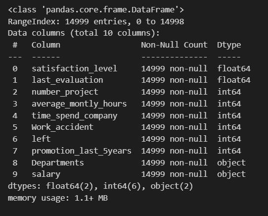
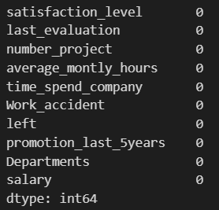
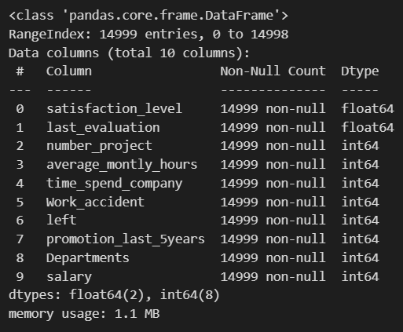

# Implementation-of-Decision-Tree-Classifier-Model-for-Predicting-Employee-Churn

## AIM:
To write a program to implement the Decision Tree Classifier Model for Predicting Employee Churn.

## Equipments Required:
1. Hardware – PCs
2. Anaconda – Python 3.7 Installation / Jupyter notebook

## Algorithm
1. Import the necessary packages using import statement. 
2. Read the given csv file using read_csv() method and print the number of contents to be displayed using df.head().
3. Import KMeans and use for loop to cluster the data.
4. Predict the cluster and plot data graphs.
5. Print the outputs and end the program

## Program:
### Program to implement the Decision Tree Classifier Model for Predicting Employee Churn.
```py
# Developed by: YUVARAJ.S
# RegisterNumber: 22008589 
import pandas as pd
import numpy as np
data=pd.read_csv("Employee.csv")
data.head()
data.info()
data.isnull().sum()
data["left"].value_counts()
from sklearn.preprocessing import LabelEncoder
l=LabelEncoder()
data["salary"]=l.fit_transform(data["salary"])
data.head()
data["Departments "]=l.fit_transform(data["Departments "])
data.head()
data.info()
data.shape
x=data[['satisfaction_level','last_evaluation','number_project','average_montly_hours','time_spend_company','Work_accident','promotion_last_5years','Departments ','salary']]
x.head()
x.shape
x.info()
y=data['left']
from sklearn.model_selection import train_test_split
x_train,x_test,y_train,y_test=train_test_split(x,y,test_size=0.2,random_state=100)
from sklearn.tree import DecisionTreeClassifier
dt=DecisionTreeClassifier(criterion="entropy")
dt.fit(x_train,y_train)
y_pred=dt.predict(x_test)
print(y_pred)
from sklearn import metrics
accuracy=metrics.accuracy_score(y_test,y_pred)
print("Accuracy = ",accuracy)
dt.predict([[0.5,0.8,9,260,6,0,1,2,1]])
```

## Output:
### Read CSV File:

### Dataset Info : 



### Dataset Value Count :

### Dataset Head :


### Dataset Info :

### Dataset Shape :


### Y-Pred :


### Accuracy :


### Dataset Predict :


## Result:
Thus the program to implement the  Decision Tree Classifier Model for Predicting Employee Churn is written and verified using python programming.
